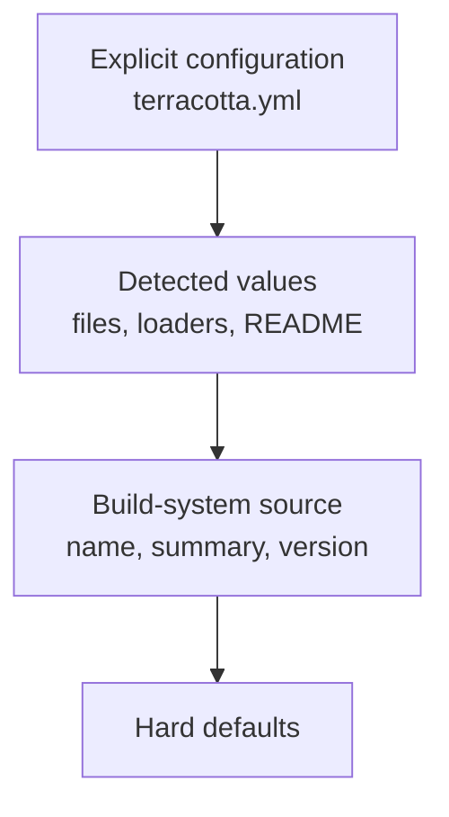

# Metadata Resolution

Terracotta resolves project metadata from three sources: explicit configuration, auto-detection, and build-system defaults. The design prioritizes user intent while reducing repetitive configuration.

## Resolution layers

Values flow downward only when a higher layer does not provide one.

## Why explicit values win

A user who writes a value in `terracotta.yml` has made a deliberate choice. Detected values are guesses, even when accurate. Respecting explicit configuration prevents surprising overrides.

## Why detection is second

When a value is absent from configuration, Terracotta inspects files the project already contains:

- `README.md` for summary and description.
- `LICENSE` for the SPDX identifier.
- Loader descriptors for game versions and environment.
- Loader presence for supported platforms.

This reduces boilerplate because most projects already declare this information.

## Why build-system values are third

The build system knows the project name, summary, and version. These values are reliable but generic. They fill gaps only when configuration and detection are silent.

## Why defaults exist

Some fields must always have a value. For example, `environment` defaults to `SERVER_ONLY` because most Minecraft plugins run on servers, and `releaseType` defaults to `RELEASE` for stable uploads.

## Merge behavior for lists

When two sources provide `gameVersions` or `loaders`, Terracotta combines them as a distinct union rather than choosing one. This lets configuration extend detected values instead of replacing them.

## See also

- [Metadata Resolution Reference](../reference/metadata-resolution.md)
- [Resolve Project Metadata](../how-to-guides/resolve-project-metadata.md)
