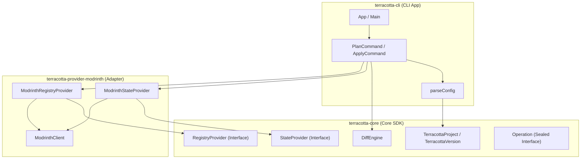
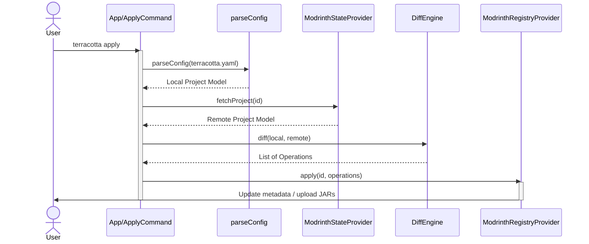

# Architecture Overview

Terracotta follows clean code and modular design principles, isolating the core domain logic from the specific registry adapters (e.g. Modrinth) and the CLI interface.

## Layer & Module Overview

### Core SDK (`terracotta-core` under `modules/terracotta-core`)

**Package:** `io.github.beduality.terracotta.core.*`

A pure platform-agnostic library containing canonical models, provider interfaces, and the semantic diff engine.

| Class / Package | Responsibility |
|---|---|
| `core.model.TerracottaProject` | Canonical model representing project config metadata, tags, license, and versions. |
| `core.model.TerracottaVersion` | Canonical model representing version metadata and the compiled artifact file path. |
| `core.provider.StateProvider` | Abstraction to fetch the remote project state. |
| `core.provider.RegistryProvider` | Abstraction to apply a list of generic operations to the remote registry. |
| `core.diff.DiffEngine` | Compares local and remote models to produce a set of semantic operations. |
| `core.diff.Operation` | Sealed interface representing mutations (`UpdateMetadata`, `UpdateDescription`, `UpdateTags`, `UploadVersion`). |

### Modrinth Provider (`terracotta-provider-modrinth` under `modules/terracotta-provider-modrinth`)

**Package:** `io.github.beduality.terracotta.provider.modrinth.*`

Bridges the core interfaces with Modrinth's REST API using OkHttp and Jackson.

| Class | Responsibility |
|---|---|
| `ModrinthClient` | Low-level HTTP client executing requests against Modrinth. |
| `ModrinthStateProvider` | Fetches project info and versions and translates them into canonical models. |
| `ModrinthRegistryProvider` | Translates the computed operations list into concrete PATCH and POST API calls. |

### CLI Module (`terracotta-cli` under `modules/terracotta-cli`)

**Package:** `io.github.beduality.terracotta.cli.*`

Command line interface providing `plan` and `apply` actions.

| Class | Responsibility |
|---|---|
| `App` | Picocli configuration commands and entry point. |
| `ConfigParser` | Parses the `terracotta.yaml` config and resolves file paths relative to the file. |

---

## Core Abstractions

### 1. Canonical Model

Both the local configuration YAML file and the remote registry metadata are mapped to the same internal domain models: `TerracottaProject` and `TerracottaVersion`.

### 2. Diff Engine

The `DiffEngine` computes a list of `Operation` objects to perform based on differences between local and remote models.

### 3. Providers

- **`StateProvider`**: Fetches remote registry assets and translates them into the Canonical Model.
- **`RegistryProvider`**: Translates generic `Operation` lists into registry-specific actions (e.g. PATCH requests or file uploads).

---

## Request Flow

## Design Decisions

**Why separate Core SDK from the CLI?**

:   By keeping `terracotta-core` generic and publishing it to Maven Central, we enable developers to write custom Gradle, Maven, IDE, or CI/CD plugins directly on top of the domain layer, without forcing them to invoke command line subprocesses.

**Why decouple registries using Provider Interfaces?**

:   Abstracting operations behind the `StateProvider` and `RegistryProvider` interfaces ensures the core engine remains clean and free of network logic. Adding new providers in the future (e.g. Hangar or CurseForge) is as simple as implementing those interfaces.
