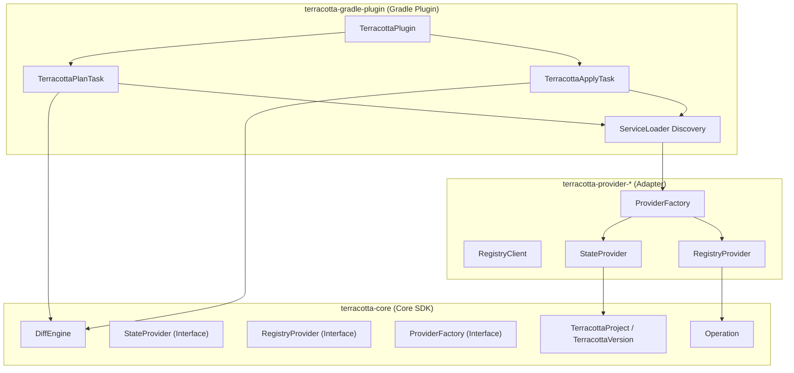

# Core Architecture

`terracotta-core` is a pure Kotlin library that contains the domain logic shared by every Terracotta integration.

## What belongs in core

Core is responsible for:

- Reading `terracotta.yml`.
- Detecting loaders and project metadata from files.
- Resolving effective metadata from explicit, detected, and default sources.
- Comparing local and remote project states.
- Defining the SPI that registry providers implement.

Core is explicitly **not** responsible for:

- Gradle task wiring.
- HTTP calls to specific registries.
- Platform-specific artifact handling.

## Why separate core from the Gradle plugin

Keeping core independent means the same logic can be reused by:

- A Gradle plugin.
- A Maven plugin.
- A CLI tool.
- An IDE plugin.
- A CI/CD action.

If the domain logic lived inside the Gradle plugin, every new integration would need to reimplement detection, resolution, and diffing.

## Why separate providers from core

Registries such as Modrinth and Hangar have different authentication, rate limits, and API shapes. By defining only `StateProvider` and `RegistryProvider` interfaces, core remains stable while new registries are added as separate modules.

## Module diagram

## Core abstractions

- **Canonical model**: `TerracottaProject` and `TerracottaVersion` are the same regardless of build tool or registry.
- **Diff engine**: `DiffEngine` turns state differences into registry-agnostic `Operation` objects.
- **Provider SPI**: `ProviderFactory`, `StateProvider`, and `RegistryProvider` let registries plug in without modifying core.

## See also

- [Diff Engine](diff-engine.md)
- [Loader Hierarchy](loader-hierarchy.md)
- [Provider Interfaces](../reference/provider-interfaces.md)
