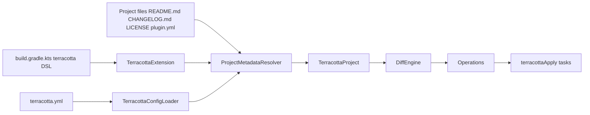

# Gradle Plugin Architecture

The Terracotta Gradle plugin is a thin bridge between Gradle conventions and the core Terracotta library. It does not contain registry-specific logic; instead, it configures the core components from values found in your build.

## Responsibilities

The plugin has three responsibilities:

1. **Register the `terracotta` DSL extension** so build scripts can configure metadata.
2. **Resolve effective metadata** by combining `terracotta.yml`, auto-detected values, and Gradle project properties.
3. **Register `terracottaPlan` and `terracottaApply` tasks** for each configured provider.

## Component flow

## Why keep logic in core?

The plugin intentionally delegates to `terracotta-core` so that the same metadata resolution, diff, and provider abstractions can be reused by non-Gradle consumers such as the SDK and CLI.

See the [Core Architecture](../core/explanation/architecture.md) for the corresponding design on the core side.
