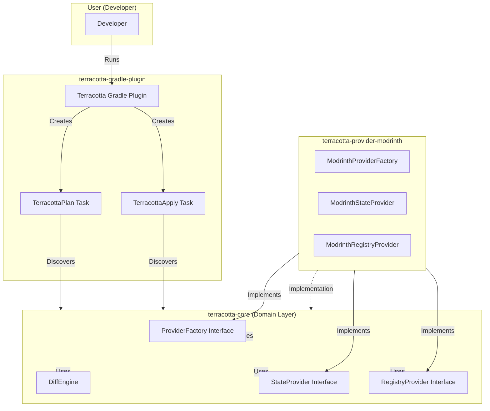

# Architecture

This document explains the internal architecture of Terracotta and the reasoning behind key design decisions.

## Core Principles

Terracotta follows a **separation of concerns** architecture:

1. **Domain Logic**: Pure, platform-agnostic business logic
2. **Registry Providers**: Registry-specific implementations
3. **Build Tool Integration**: Gradle plugin as the user-facing interface
4. **Infrastructure**: Code for managing project infrastructure

This separation ensures that changes to one component don't require changes to others.

## Architecture Diagram

## The Domain Layer (`terracotta-core`)

The domain layer is the heart of Terracotta. It contains:

### Canonical Data Models

All project data structures live in `core.model`:

- `TerracottaProject`: The canonical project representation
- `TerracottaVersion`: Version metadata and files
- `TerracottaEnvironment`: Runtime environment (CLIENT, SERVER, CLIENT_SERVER)

**Key principle**: These models are platform-agnostic. They don't know about Modrinth, CurseForge, or any other registry.

### Provider Interfaces

Providers are defined as interfaces in `core.provider`:

- `ProviderFactory`: Factory for creating registry-specific providers
- `StateProvider`: Fetches remote project state
- `RegistryProvider`: Applies changes to a registry

**Key principle**: The core layer depends only on interfaces, not implementations. This allows multiple providers.

### Diff Engine

The `DiffEngine` computes the difference between local and remote project states.

**Input**: Local project (always exists), Remote project (may be null)

**Output**: List of `Operation` instances describing what needs to be done

**Operations**:
- `CreateProject`: Create a new project
- `UploadVersion`: Upload a new version
- `UpdateMetadata`: Update project name/summary/license
- `UpdateDescription`: Update project description
- `UpdateTags`: Update project tags

**Key principle**: The diff engine is pure logic. It doesn't make network calls or depend on any registry.

## The Provider Layer (`terracotta-provider-modrinth`)

Each registry has its own provider implementation:

### Implementation Strategy

1. Implement `ProviderFactory` with registry-specific initialization
2. Implement `StateProvider` using the registry's API client
3. Implement `RegistryProvider` to apply changes via the registry's API

### Modrinth Provider Details

The Modrinth provider uses:

- **Ktor Client**: HTTP client for API requests
- **Kotlinx Serialization**: JSON serialization for requests/responses
- **API Documentation**: [Modrinth API Docs](https://docs.modrinth.com/)

### Provider Discovery

Providers are discovered via Java's `ServiceLoader` mechanism:

1. Provider implementations register themselves via `META-INF/services`
2. The Gradle plugin loads all available providers at runtime
3. Users select a provider by name in their Gradle configuration

**Key principle**: New providers can be added without modifying core code.

## The Gradle Plugin (`terracotta-gradle-plugin`)

The Gradle plugin provides the user-facing interface:

### Key Concepts

**Tasks**:
- `terracottaPlan`: Compute what needs to be changed (read-only)
- `terracottaApply`: Apply changes to registries

**Provider Selection**:
- Users configure which providers to use
- The plugin discovers available providers via ServiceLoader
- Multiple providers can be used simultaneously

**Environment Support**:
- `CLIENT_ONLY`: Only client-side content
- `SERVER_ONLY`: Only server-side content  
- `CLIENT_SERVER`: Both client and server content

### How It Works

1. User runs `./gradlew terracottaPlan`
2. Plugin loads configured providers
3. Plugin fetches remote state from each provider
4. Plugin compares local vs remote state using `DiffEngine`
5. Plugin outputs list of operations
6. User reviews plan, then runs `./gradlew terracottaApply`
7. Plugin applies operations to registries

## Infrastructure (`terracotta-github`)

Manages GitHub repository configuration using Pulumi:

- Repository settings (permissions, branches, rules)
- GitHub Actions secrets for CI/CD
- Webhook configuration

## Why This Architecture?

### Separation of Concerns

Each layer has a single, clear responsibility:

- **Core**: Business logic, no external dependencies
- **Providers**: Registry integration, no business logic
- **Gradle Plugin**: Build tool integration, no logic
- **Infrastructure**: Code management, no application logic

### Testability

- Core logic can be tested without network calls
- Providers can be tested with mocks of the core interfaces
- Gradle plugin tests can mock provider discovery

### Extensibility

Adding a new registry provider requires:

1. Create a new module
2. Implement the three provider interfaces
3. Register via ServiceLoader
4. Add to build configuration

**No changes to core, Gradle plugin, or other providers needed.**

### Maintainability

- Changes to Modrinth API only affect the Modrinth provider
- Changes to Gradle API only affect the Gradle plugin
- Core domain logic remains stable

## Versioning and Releases

Versions are managed consistently across all modules:

- Core modules published to Maven Central
- Gradle plugin published to Gradle Plugin Portal
- All versions tracked in `gradle/libs.versions.toml`

See [Releasing](../how-to-guides/releasing.md) for the release process.
