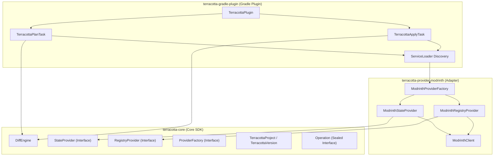
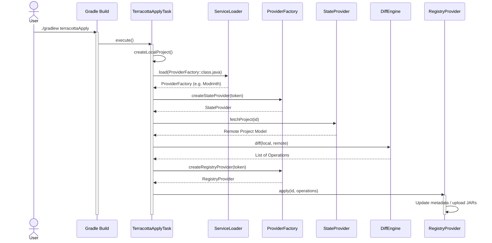

# Architecture Overview

Terracotta follows clean code and modular design principles, isolating the core domain logic from the specific registry adapters (e.g. Modrinth) and the build-tool integration (Gradle plugin).

## Layer & Module Overview

### Core SDK (`terracotta-core` under `modules/terracotta-core`)

**Package:** `io.github.beduality.terracotta.core.*`

A pure platform-agnostic library containing canonical models, provider interfaces, and the semantic diff engine.

| Class / Package | Responsibility |
|---|---|
| `core.model.TerracottaProject` | Canonical model representing project config metadata, tags, license, and versions. |
| `core.model.TerracottaVersion` | Canonical model representing version metadata and the compiled artifact file path. |
| `core.model.loader.TerracottaLoader` | Interface and registry for detecting mod/plugin platforms from project files. |
| `core.model.metadata.ProjectMetadataLoader` | Merges explicit, detected, and default project metadata. |
| `core.model.projectfile.ProjectFileCache` | Caches reads of project files so detectors and conventions can share them. |
| `core.model.projectfile.ProjectFileConvention` | Registry of conventions for interpreting `README.md` and `CHANGELOG.md`. |
| `core.config.TerracottaConfig` / `TerracottaConfigLoader` | In-memory representation and loader for `terracotta.yml`. |
| `core.provider.ProviderFactory` | Factory interface for creating state and registry providers. Discovered via Java ServiceLoader. |
| `core.provider.StateProvider` | Abstraction to fetch the remote project state. |
| `core.provider.RegistryProvider` | Abstraction to apply a list of generic operations to the remote registry. |
| `core.diff.DiffEngine` | Compares local and remote models to produce a set of semantic operations. |
| `core.diff.Operation` | Sealed interface representing mutations (`CreateProject`, `UpdateMetadata`, `UpdateDescription`, `UpdateTags`, `UploadVersion`). |

### Modrinth Provider (`terracotta-provider-modrinth` under `modules/terracotta-provider-modrinth`)

**Package:** `io.github.beduality.terracotta.provider.modrinth.*`

Bridges the core interfaces with Modrinth's REST API using Ktor Client and Kotlinx Serialization.

| Class | Responsibility |
|---|---|
| `ModrinthProviderFactory` | ServiceLoader entry point that creates state and registry providers for Modrinth. |
| `ModrinthClient` | Low-level HTTP client executing requests against Modrinth using Ktor. |
| `ModrinthStateProvider` | Fetches project info and versions and translates them into canonical models. |
| `ModrinthRegistryProvider` | Translates the computed operations list into concrete PATCH and POST API calls. |

### Gradle Plugin (`terracotta-gradle-plugin` under `modules/terracotta-gradle-plugin`)

**Package:** `io.github.beduality.terracotta.gradle.*`

Build-tool integration providing `plan` and `apply` tasks with a Gradle DSL for configuration.

| Class | Responsibility |
|---|---|
| `TerracottaPlugin` | Registers the `terracotta` extension and creates per-provider tasks dynamically. |
| `TerracottaExtension` | DSL entry point for configuring project metadata and providers. |
| `TerracottaProviderExtension` | Per-provider DSL configuration (project ID, token). |
| `TerracottaPlanTask` | Computes and displays the diff between local config and remote state for a provider. |
| `TerracottaApplyTask` | Computes the diff and applies operations to a provider's registry. |

---

## Core Abstractions

### 1. Canonical Model

Both the local Gradle build configuration and the remote registry metadata are mapped to the same internal domain models: `TerracottaProject` and `TerracottaVersion`.

### 2. Diff Engine

The `DiffEngine` computes a list of `Operation` objects to perform based on differences between local and remote models.

### 3. Providers

- **`ProviderFactory`**: Creates state and registry providers for a specific registry. Discovered at runtime via Java `ServiceLoader`.
- **`StateProvider`**: Fetches remote registry assets and translates them into the Canonical Model.
- **`RegistryProvider`**: Translates generic `Operation` lists into registry-specific actions (e.g. PATCH requests or file uploads).

---

## Request Flow

## Design Decisions

**Why separate Core SDK from the Gradle Plugin?**

:   By keeping `terracotta-core` generic and publishing it to Maven Central, we enable developers to write custom Gradle, Maven, IDE, or CI/CD plugins directly on top of the domain layer, without forcing them to use any specific build tool.

**Why decouple registries using Provider Interfaces?**

:   Abstracting operations behind the `StateProvider` and `RegistryProvider` interfaces ensures the core engine remains clean and free of network logic. Adding new providers in the future (e.g. Hangar or CurseForge) is as simple as implementing those interfaces and registering via ServiceLoader.

**Why use ServiceLoader for provider discovery?**

:   Java's `ServiceLoader` mechanism allows providers to be added as regular dependencies without any coupling between the Gradle plugin and specific provider implementations. Users simply add the provider JAR to their classpath and configure it in the DSL.
