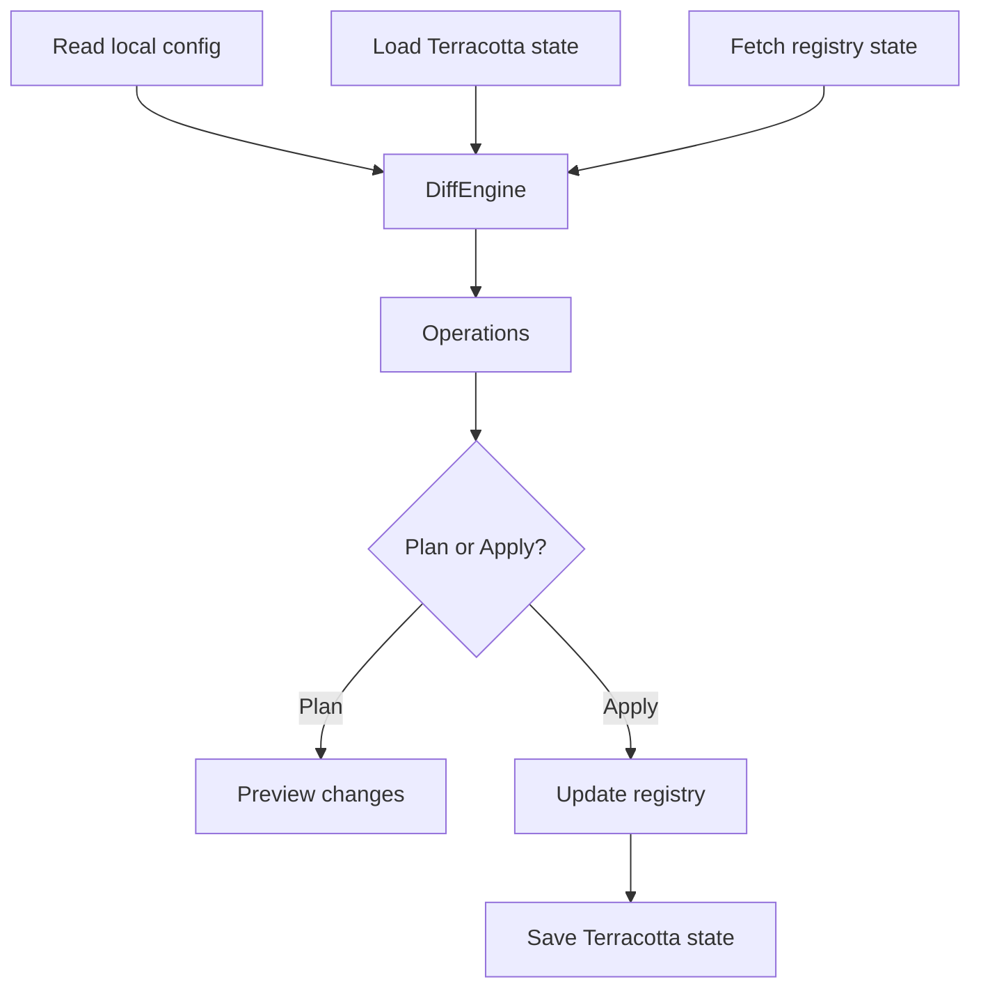

# Terracotta

Declarative publishing for Minecraft projects. Define your metadata once in `terracotta.yml` or in your build configuration like [Gradle](https://gradle.org/), then sync with the [Modrinth](https://modrinth.com/) registry. Add [Hangar](https://hangar.papermc.io/) later using the same workflow.

---

<div class="grid cards" markdown>

-   :material-file-document-edit-outline:{ .lg .middle } __Define Once__

    ---

    Describe your project in one place; Terracotta auto-detects the rest from `README.md`, `LICENSE`, `CHANGELOG.md`, and platform-specific files.

-   :material-eye-outline:{ .lg .middle } __Plan Before You Publish__

    ---

    Preview every registry change before it goes live.

-   :material-publish:{ .lg .middle } __Publish to Registries__

    ---

    Sync metadata, versions, and gallery images to Modrinth, Hangar, or any supported registry.

-   :material-puzzle:{ .lg .middle } __Pluggable by Design__

    ---

    Core, providers, and integrations are separate modules. Add new registries or build tools without rewriting your workflow.

</div>

## What Terracotta does

Terracotta reads your project configuration, persisted Terracotta state, and registry state, then computes the smallest set of semantic operations needed to bring the registry in line.



??? info "Stable identity keys"
    Any Terracotta-managed entity can declare a stable `key` so it is matched by identity across runs. Gallery images are one example: assigning a key avoids accidental delete-and-reupload cycles when you rename or reorder screenshots.

??? example "Example plan output"
    ```text
    ~ Update summary (from: "Old summary" to: "Lightweight Paper plugin")
    ~ Update categories (from: ["utility"] to: ["utility", "paper"])
    + Upload version 1.2.0 (file: build/libs/my-plugin-1.2.0.jar)
    ```

## Why use Terracotta

Stop manually updating Modrinth project pages, version metadata, and gallery images. Terracotta is built for Minecraft developers who want:

- **One source of truth** — declare metadata in `terracotta.yml` or Gradle and let Terracotta auto-detect the rest.
- **Confidence before shipping** — preview every create, update, upload, and delete operation before it runs.
- **Safe gallery management** — stable image keys prevent accidental re-uploads when you rename or reorder screenshots.
- **Room to grow** — start with Modrinth and add Hangar later without rebuilding your workflow.

## Get started

<div class="grid cards" markdown>

-   :material-rocket-launch-outline:{ .lg .middle } __Quick Start with Gradle__

    ---

    Publish your first release to Modrinth in minutes with the Gradle plugin.

    [Get started](content/modules/gradle-plugin/tutorials/getting-started.md)

-   :material-code-braces:{ .lg .middle } __Use the Core SDK__

    ---

    Build Terracotta into your own tooling or CI pipeline.

    [Modrinth provider tutorial](content/modules/provider-modrinth/tutorials/using-modrinth.md)

-   :material-book-open-variant:{ .lg .middle } __Explore the Docs__

    ---

    Find integration guides, module references, and contribution docs.

    [Navigating the Docs](content/navigating-docs.md)

</div>

## Links

- [:fontawesome-brands-github: GitHub](https://github.com/beduality/terracotta)
- [:fontawesome-brands-discord: Discord](https://discord.gg/D5meCv2Wnd)
- [License](LICENSE.md)
